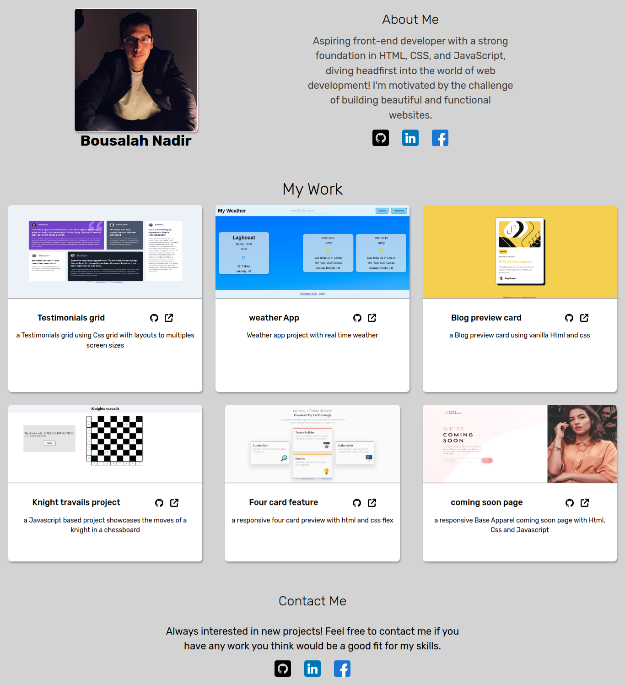
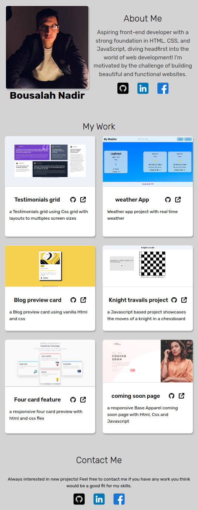
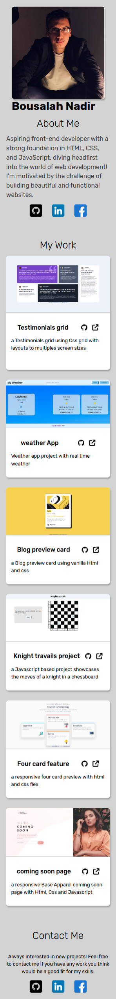

# The-odin-project-Homepage
This is a solution to the odin-project Homepage, where the challenge is 
to create a responsive homepage displying a my previous projects

## Table of contents

- [Overview](#overview)
  - [Screenshot](#screenshot)
  - [Links](#links)
- [My process](#my-process)
  - [Built with](#built-with)
- [Author](#author)

## Overview

### Screenshot

  ## Desktop 
  

  ## Tablet
  

  ## Mobile 
  

### Links

- Solution URL: [solution](https://github.com/Medido1/The-odin-project-Homepage)
- Live Site URL: [live site](https://medido1.github.io/The-odin-project-Homepage/)

## My process

### Built with

- Semantic HTML5 markup
- CSS custom properties
- CSS Grid
- Flexbox
- Mobile-first workflow

## Author

- Frontend Mentor - [@Medido1](https://www.frontendmentor.io/profile/Medido1)
- GitHub - [@Medido1](https://github.com/Medido1)

